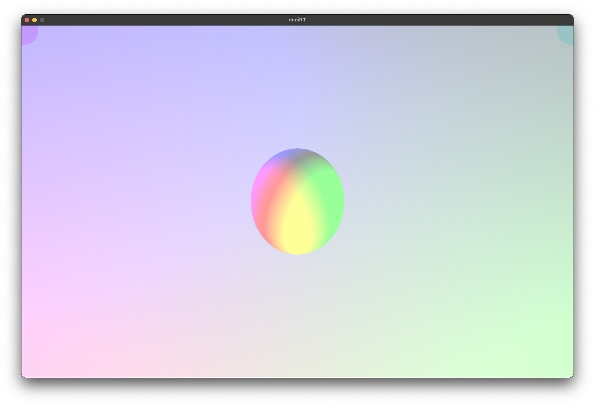
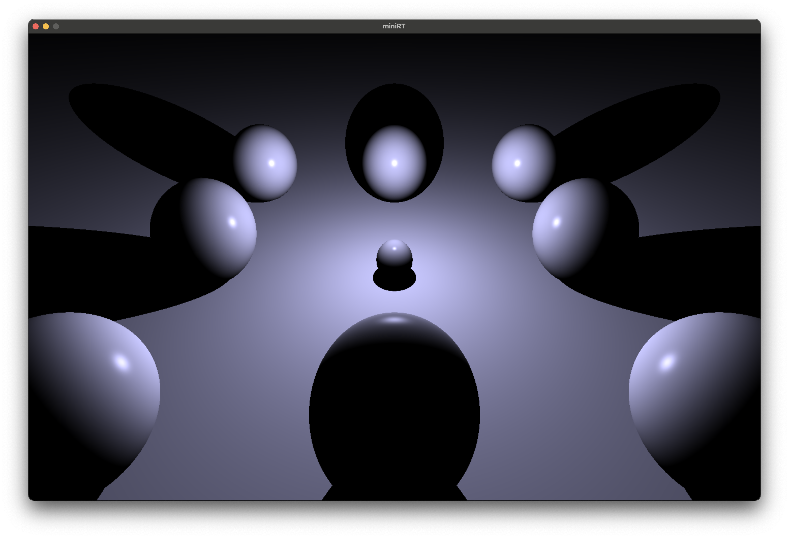

# miniRT Project

## Project Overview
miniRT is a simple 3D graphic renderer using ray tracing. This project is created to enhance understanding of computer graphics and ray tracing principles.



<details>
<summary><b style="font-size:25px">More images!</b></summary>

scene: scenes/parallel_light.rt

</details>

## Getting Started

### System Requirements
- macOS or Linux operating system
- Installation of OpenGL and other necessary dependencies

### Installation and Build
1. Clone the repository.
```bash
git clone https://github.com/seungwonme/miniRT.git
cd miniRT
```
2. Run the build script.
```
make
```

### Execution
After the build is complete, you can run the program with the following command.
```bash
./miniRT scenes/[scene].rt
```

## Usage
- Press the `ESC` key to exit the program during rendering.
- Press the `W`, `A`, `S`, `D` keys to move the camera.
- Press the `↑`, `←`, `↓`, `→` keys to rotate the camera.

## Examples
Test various rendering examples included in the `scenes` folder with different `.rt` files.

